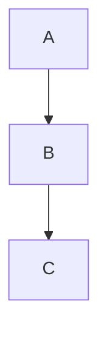

# Chirpy 写作语法全集（纯 Markdown 示例）

> 本文 **完全使用 Markdown 文本**  
> 所有示例 **仅展示写法，不会被执行或渲染**

---

## 1. 基础文本

普通文本  
**加粗**  
*斜体*  
~~删除线~~  
`inline code`

链接：

[Chirpy 官网](https://chirpy.cotes.page)

---

## 2. 分类与标签（Front Matter）

```yaml
categories: [Blog, Chirpy]
tags: [chirpy, jekyll, markdown]
```

---

## 3. 引用 Blockquote

```md
> This is a quote.
```

> This is a quote.

---

## 4. Prompt（提示块）

```md
> Info prompt
{: .prompt-info }
```

```md
> Tip prompt
{: .prompt-tip }
```

```md
> Warning prompt
{: .prompt-warning }
```

```md
> Danger prompt
{: .prompt-danger }
```

---

## 5. 列表

### 无序列表

```md
- Item A
- Item B
  - Sub Item
```

### 有序列表

```md
1. Step One
2. Step Two
3. Step Three
```

### Task List

```md
- [x] Done
- [ ] Todo
```

---

## 6. 表格

```md
| Feature | Supported |
|---------|-----------|
| TOC     | Yes       |
| Math    | Yes       |
```

---

## 7. 代码块

### 普通代码块

````md
```
Plain text
```
````

### 指定语言

````md
```yaml
key: value
```
````

### 隐藏行号

````md
```shell
echo "Hello"
```
{: .nolineno }
````

### 指定文件名

````md
```shell
bundle exec jekyll serve
```
{: file="run.sh" }
````

---

## 8. 文件路径高亮

```md
`/assets/img/favicons/site.webmanifest`{: .filepath }
```

---

## 9. 图片（Image）

### 普通图片 + Caption

```md
{: w="700" h="400" }
_Image caption_
```

### 图片位置

```md
{: .normal }
{: .left }
{: .right }
```

### Light / Dark 模式

```md
{: .light }
{: .dark }
```

### Shadow

```md
{: .shadow }
```

---

## 10. LQIP

```md
{: lqip="/lqip.png" }
```

---

## 11. 社交平台嵌入（文本示例）

```md

```

```md

```

---

## 12. 本地视频（文本示例）

```md

```

---

## 13. 音频（文本示例）

```md

```

---

## 14. 数学公式（MathJax 写法）

### 块公式

```md
$$
E = mc^2
$$
```

### 编号公式

```md
$$
\begin{equation}
a^2 + b^2 = c^2
\label{eq:pythagoras}
\end{equation}
$$
```

### 行内公式

```md
This is inline math: $$ x + y = z $$
```

### 列表中的公式

```md
1. \$$ a + b $$
2. \$$ c + d $$
```

---

## 15. Mermaid（文本示例）

```md

```

---

## 16. Liquid 代码原样展示

```md


Pinned


```

---

## 17. 折叠内容（HTML）

```md
<details>
<summary>Click</summary>

Hidden content

</details>
```

---

## 18. 推荐资源结构

```text
assets/
├── img/posts/demo/
│   ├── preview.png
│   ├── demo.png
│   └── lqip.png
```

---

## 结束

✔ 纯 Markdown  
✔ 不触发 Chirpy 渲染  
✔ 适合作为 **写作速查表 / 模板仓库**
